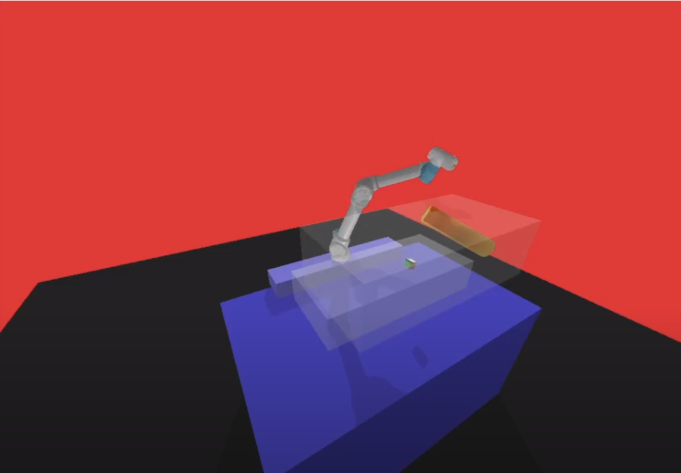

# UR-gym

Our project introduces a suite of robotic environments powered by the PyBullet physics engine and Gymnasium framework. This repository contains the implementation for training and testing the UR5e robot using the Soft-Actor Critic algorithm. Our research has been recognized for its contribution to the field, with our paper accepted by the SME NAMRC52 conference, pending publication.

The development of this project is inspired by and builds upon the foundation provided by the panda-gym ([https://github.com/qgallouedec/panda-gym](https://github.com/qgallouedec/panda-gym)).


## Project Overview

We have developed four distinct environments for the UR5e robot, enhancing its ability to navigate and interact within simulated spaces. These environments include:

-   **UR5OriReach-v1**: Aims to train the robot to reach a specific coordinate by aligning both its position and orientation accurately.
    
-   **UR5ObsReach-v1**: Focuses on the robot's capability to reach a designated coordinate by aligning its position while navigating through an environment with static obstacles.
    
-   **UR5StaReach-v1**: Enhances the robot's precision in reaching a designated coordinate with both position and orientation alignment, in the presence of static obstacles.
    
-   **UR5DynReach-v1**: Challenges the robot to reach a specified coordinate, aligning both position and orientation in a dynamic environment with moving obstacles.
```
[](https://www.youtube.com/watch?v=Tq03JQw-MHw)
```

## Installation
```bash
git clone https://github.com/WanqingXia/UR-gym.git
```

## Project Structure
```
<pre>
UR-gym
|──Trained_Models
	|──Trained_Dyn            # Trained model with UR5DynReach-v1 environment
	|──Trained_Obs            # Trained model with UR5ObsReach-v1 environment
	|──Trained_Ori            # Trained model with UR5OriReach-v1 environment
	└──Trained_Sta            # Trained model with UR5StaReach-v1 environment
|──UR_gym                     # Main code for environment construction
	|──assets                 # Images used for rendering
	|──envs                   # Environments
		|──robots
			|──meshes         # Meshes for UR5e robot
			|──urdf           # URDF file for UR5e robot
			└──UR5.py         # Defines robot behaviour
		|──tasks			  
			└──reach.py		  # Define our environments
		|──core.py            # Core functions for environments
		└──ur_tasks.py
	|──pyb_setup.py           # Core functions for PyBullet setup
	└──utils.py               # Helpful utils
|──utils
	|──callbackFunctions.py   # Callback functions for logging
	└──generate.py            # Functions to generate test set
|──demo.py                    # Demo code
|──model_test.py              # Test trained model
|──robot_show.py              # Display the virtual robot
|──setup.py
|──show_traj.py               # Record robot moving trajectory
└──train.py                   # Robot training code
</pre>
```
## Usage

### Simple demo (provided in demo.py)
```python
import sys
import gymnasium
sys.modules["gym"] = gymnasium
import UR_gym

env = gymnasium.make('UR5OriReach-v1', render="human")

observation, info = env.reset()

for _ in range(1000):
    action = env.action_space.sample() # random action
    observation, reward, terminated, truncated, info = env.step(action)

    if terminated or truncated:
        observation, info = env.reset()

env.close()
```

### Train the model
```python
# Train a SAC controlled UR5e robot to avoid dynamic obstacles
python train.py
```

### Run our trained model
```python
python model_test.py
```